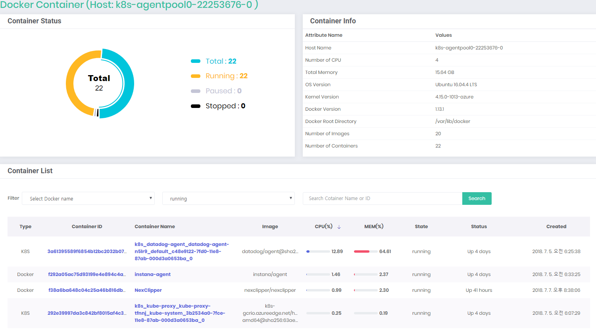

# NexClipper Light 
NexClipper light is a host level monitoring tool for Docker, DC/OS and Kubernetes without additional longterm data store, and not for container cluster level. But it provides almost necessary information to monitor Docker instantly.
NexClipper Light features the following capabilities:
* Dashboard
* Container list
* Status of containers (total continers, running, paused, stopped)
* Number of Images
* Container resource usage (cpu, memory, network, block i/o)
* Container process, network , environment, network, log


# Quick Start: 
# Running NexClipper Light in a Docker Container
You can run NexClipper to monitor the Docker containers.  
Simply run:

```
sudo docker pull nexclipper/nexclipper;
```

```
sudo docker run \
	     --detach=true \
	     --name NexClipper \
	     -p 10001:9001 \
	     --volume /var/run/docker.sock:/var/run/docker.sock \
	     --volume /var/lib/docker:/var/lib/docker \
	     nexclipper/nexclipper;
```

# Running NexClipper Light on Kubernetes

```
kubectl create -f nexclipperlight.yaml
```


**NexClipper light is now running (in the background) on http://localhost:10001.**

# NexClipper Light Web UI
NexClipper exposes a web UI at its port:  
**http://<HOST_IP>:<HOST_PORT>/**

# NexClipper Light Dashboard
The dashboard shows the container's statistics, status, logs, and various information.
  


