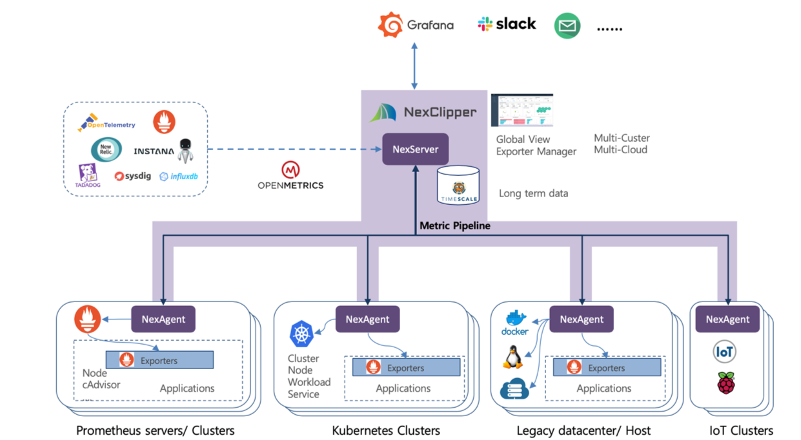
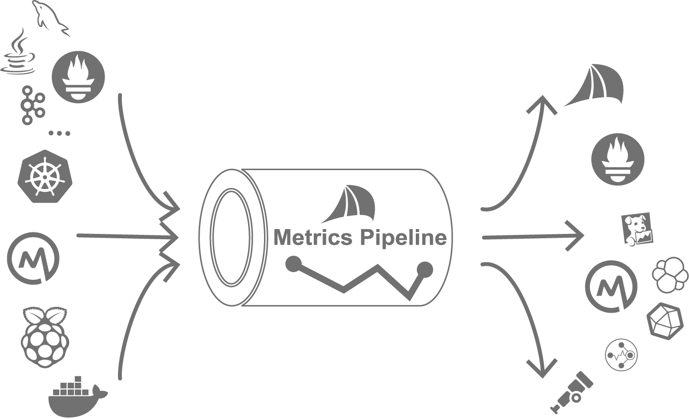

**Previous version (NexClipper v0.1.0) has been moved to NexClipperBasic repository: [NexClipperBasic](https://github.com/NexClipper/NexClipperBasic)**

# NexClipper Monitoring System

Monitor & Manage Enterprise Cloud Native Infrastructure with NexClipper, an OSS CNCF (Cloud Native Computing Foundation) Member Company

- **Cloud Native** : Manage Kubernetes & Container Clusters with Real-Time Visibility & Insight on Metrics
- **CNCF EcoSystem** : Improve OSS Interoperability & Compatibility through OpenMetrics Protocol Adoption, Contributing to CNCF Community
- **Enterprise Architecture** : Monitor Multi-Cluster & Multi-Tenancy Environments through Global Views and Unlimited Metrics Retention

## Improve Interoperability by OpenMetrics

- NexClipper Offers 'Metrics Pipeline' Which Transmits Metrics in OpenMetrics Protocol, an Open Standard for Exposing Metrics.
- Metrics Pipeline Routes to NexClipper Global View, and Can Be Compatibly Integrated with 3rd Party Monitoring Platforms such as Prometheus, DataDog, New Relic, Sysdig and etc, All Supporting OpenMetrics Exposition Format, to Reveal Different Insights.
- NexClipper Provides Prometheus Exporter Catalog with Installation Instructions for Help Setup Easily

## Make Prometheus Easier to Manage

- NexClipper's Agent-Server Way of Exposition Guarantees Transmitting Metrics within Firewalls outward for Prometheus Viewing in External Network Environment.
- Metrics Pipeline Easily Consolidates Metrics from Different System Sources, and Allows Prometheus to Connect for Integrated (Multi-Cluster) Viewing.

## Monitor Anywhere, at Any Scales

- NexClipper Comes with Limitless Horizontal Scalability and Allows Infinite Metrics Data Retention.
- It's for Enterprise : Designed for Managing Multi-Cluster & Multi-Tenancy Monitoring, NexClipper Integrates Metrics Exposed from Multiple Sources for Global Viewing to Give Full Insights.

# Overview

## Install

[Install and Run](https://github.com/NexClipper/NexClipper/blob/master/docs/install_and_run.md)

## Features

- Infrastructure monitoring (Host, Process, Container, Network)
- Kubernetes monitoring (Nodes, Workloads, Resources)
- Scrape Prometheus metrics
- Export metrics for other monitoring system through OpenMetrics
- Integrated full stack dashboard
- Customizable dashboard
- Global view and multi tenancy
- Help search and install for Prometheus exporter 
- Incidents Management (RuleSet, Alert)

## Roadmap

### v0.2.0

- Setup basic project structure
- Infrastructure monitoring: Host, Process, Container
- Kubernetes monitoring: Nodes, Workloads

### v0.3.0

- Scrape Prometheus metrics
- Export metrics for other monitoring system through OpenMetrics

### v0.4.0

- Integrated full stack dashboard
- Prometheus exporter management system for help search and install easily

### v0.5.0

- Global view and multi tenancy
- Customizable dashboard
- Incidents Management

## Architecture Overview

## Metrics Pipeline

- Provide system metrics from scraped data from clusters to other monitoring system like Prometheus through OpenMetrics standard format.

- Scrape metrics from various sources using OpenMetrics or Prometheus exposition format by agent. Agent based metric collecting strategy overcome in restricted or complex network environment.

## Prometheus Exporter Management

- Show Recommended Prometheus exporters for current system and services (well-known system first)
- Grouping and categorizing many exporters
- Help find and installation Prometheus exporter to setup monitoring system easily

## Global View

- Scrape metrics from system and services, exporters by local agent
- NexServer collects metrics from agents save these data to time series database
- Dashboard shows status and metrics from multiple sources
