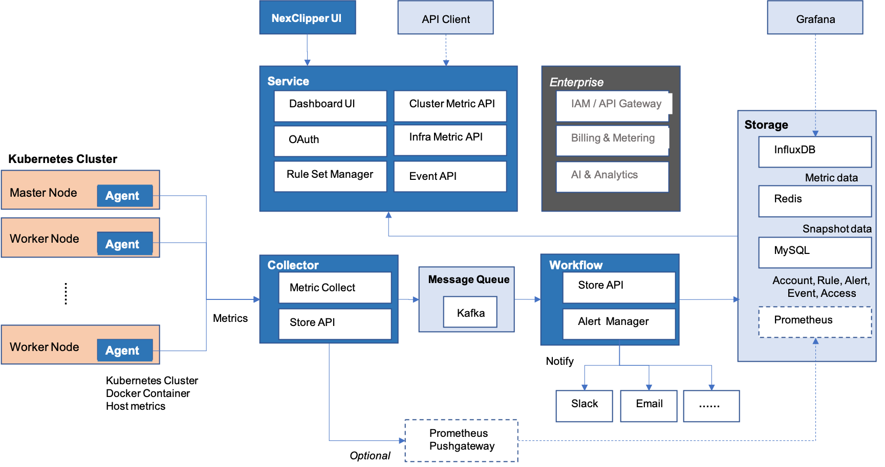
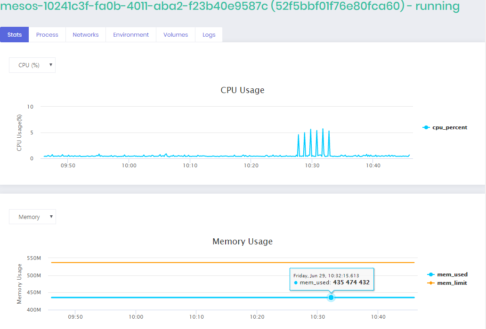

# What is NexClipper?  
There are two different versions of NexClipper: NexClipper Cloud and NexClipper light. NexClipper Cloud is for a cluster level service and collecting customer metric to NexClipper's cloud server. NexClipper light is an open soure version which installs a module for agent and web UI on host machine.

NexClipper is the container monitoring and performance management solution specialized in Docker, DC/OS, Mesosphere, Kubernetes. NexClipper Cloud especilly supports machine learning based predictive, forecasting, anormaly detection.


 

# NexClipper Cloud 
NexClipper Cloud is an online SaaS to monitor and manage performance of the container cluster -  Docker, DC/OS and Kubernetes.
NexClipper Cloud features the following capabilities:
* Fullstack dashboard (Infrastructure, DC/OS, Kubernetes)
* Container Cluster (DC/OS, Kuberentes)
* Service Performance (for API)
* Infrastruture Monitoring (Container, Host, Resource)
* Incidents Management
* AI Analytics (Forecasting, Anomaly detection, Metric correlation)

For more details visit  https://www.nexclipper.com/
For beta service, visit https://server.nexclipper.com


# NexClipper Light 
NexClipper light is a host level monitoring tool for Docker, DC/OS and Kubernetes without additional longterm data store, and not for container cluster level. But it provides almost necessary information to monitor Docker instantly.
NexClipper Light features the following capabilities:
* Dashboard
* Container list
* Status of containers (total continers, running, paused, stopped)
* Number of Images
* Container resource usage (cpu, memory, network, block i/o)
* Container process, network , environment, network, log

# NexClipper Architure 

 


# Quick Start: 
# Running NexClipper Light in a Docker Container
You can run NexClipper to monitor the Docker containers.  
Simply run:

```
sudo docker pull nexclipper/nexclipper;
```

```
sudo docker run \
	     --detach=true \
	     --name NexClipper \
	     -p 10001:9001 \
	     --volume /var/run/docker.sock:/var/run/docker.sock \
	     --volume /var/lib/docker:/var/lib/docker \
	     nexclipper/nexclipper;
```

# Running NexClipper Light on Kubernetes

```
kubectl create -f nexclipperlight.yaml
```


**NexClipper light is now running (in the background) on http://localhost:10001.**

# NexClipper Light Web UI
NexClipper exposes a web UI at its port:  
**http://<HOST_IP>:<HOST_PORT>/**

# NexClipper Light Dashboard
The dashboard shows the container's statistics, status, logs, and various information.
  



# Licensing
NexClipper is licensed under the Apache License, Version 2.0. See 
[LICENSE](https://github.com/TheNexCloud/NexClipper/blob/master/LICENSE) for the full
license text.

# Contact
Email: nexclipper@nexclipper.com

Homepage: https://www.nexclipper.com/ 

Facebook : https://www.facebook.com/nexclipper/

Linkedin: https://www.linkedin.com/company/nexcloud/

Twitter: https://twitter.com/NexClipper

