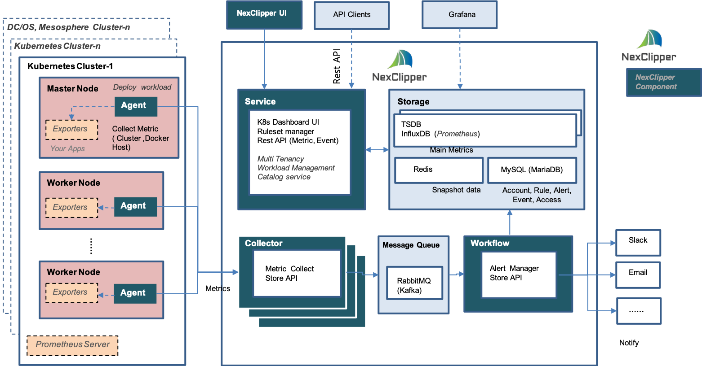
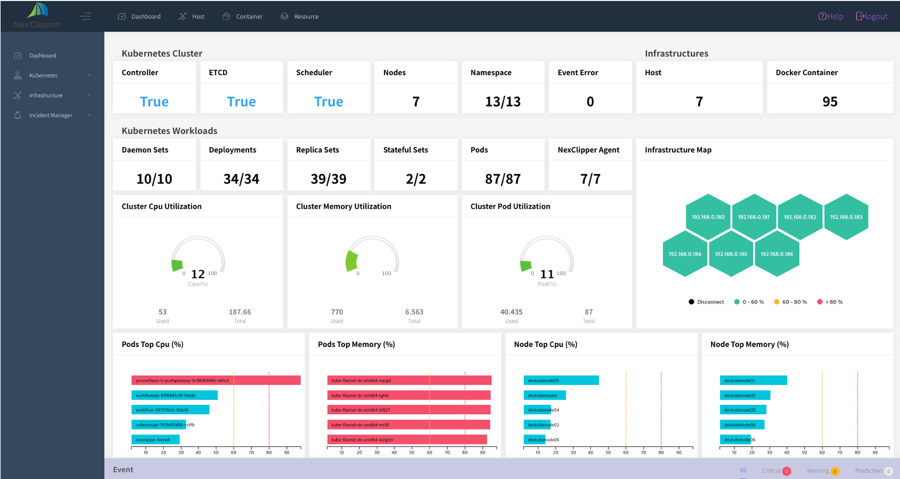

# NexClipper

### We're currently working on rebuilding NexClipper with new architecture & components. All-new NexClipper is on its way soon.


NexClipper is the container and container orchestration monitoring and performance management solution specialized in Docker, DC/OS, Mesosphere, Kubernetes. NexClipper Cloud especially supports machine learning based predictive, forecasting, anomaly detection.

There are two different versions of NexClipper: NexClipper Cloud and NexClipper.

Please note that previous  NexClipper Light project which was host level container monitoring tool was moved to [NexLight](https://github.com/NexClipper/NexClipper/tree/master/NexLight) directory.


NexClipper is a silver member of [Cloud Native Computing Foundation (CNCF)](https://landscape.cncf.io/category=monitoring&format=card-mode&grouping=category).


## NexClipper Cloud (SaaS)

NexClipper Cloud is an online SaaS to monitor and manage performance of the container cluster -  Docker, DC/OS and Kubernetes.
NexClipper Cloud features the following capabilities:
- Fullstack dashboard (Infrastructure, DC/OS, Kubernetes)
- Container Cluster (DC/OS, Kubernetes)
- Service Performance (for API)
- Infrastructure  Monitoring (Container, Host, Resource)
- Incidents Management
- AI Analytics (Forecasting, Anomaly detection, Metric correlation)

For more details visit  https://www.nexclipper.io/
For beta service, visit https://server.nexclipper.com

## NexClipper (On-Premise)

NexClipper is an open source software to monitor and manage performance of the container cluster -  Docker and Kubernetes.
NexClipper features the following capabilities:
- Fullstack dashboard (Kubernetes and Infrastructure)
- Container Cluster (Kubernetes cluster, nodes and workloads)
- Infrastructure Monitoring (Docker Container, Host, Resource)
- Incidents Management (Rule set and alert manager) (#30)
- Rest API service (Soon)
- Global view for multi cluster (Soon)
- Dashboard Enhancement to replace k8s dashboard (Soon)
- Dashboard Enhancement for customizing (Plan)
- Prometheus Integration (Plan)
- Workload management and deployment (Plan)
- Multi tenancy (Plan)
- Resource analytics and forecasting (Plan)

## Architecture Overview



## NexClipper Dashboard



## Quick Install

NexClipper can be deployed on Kubernetes cluster. 

### Prerequisites

- Installed Kubernetes Cluster (Master Node, Worker Node 1 more)
- An SSH key pair on your local Linux/macOS/BSD machine.
- ***Create namespace `nexclipper'***
- ***Download yaml files from 'yaml' directory  ***

### HELM chart Deployment

- [If you want to use HELM chart to install, Go to](https://github.com/NexClipper/NexClipper/tree/dev/HELM/README.md)


### Prepare deployment

From your master node run kubectl create. 

> #### namespace

- create
```sh
  $ kubectl create -f <yaml/namespace/createNamespaces.yaml>
```
> #### redis

- create
```sh
  $ kubectl create -f <yaml/redis/deployment.yaml>
  $ kubectl create -f <yaml/redis/service.yaml>
```

> #### mysql(or mariaDB)

- Update hostpath for volume
```yaml
// yaml/mysql/deployment.yaml
...
volumes:
  - name: mysql-data
    hostPath:
      path: /nfs/mysql        # update hostpath
...
```

- create
```sh
  $ kubectl create -f <yaml/mysql/deployment.yaml>
  $ kubectl create -f <yaml/mysql/service.yaml>
```

- Create Mysql table and data
```sh
  $ kubectl exec -it <mysql pod id> -n nexclipper sh
  > mysql -uadmin -ppassword
  > use defaultdb
  > (Execute stript of load.sql at https://github.com/NexClipper/NexClipper/blob/master/yaml/mysql/load.sql) 
```

- [If you want to use your own database instead of 'detaultdb', Go to](https://github.com/NexClipper/NexClipper/blob/dev/docs/option/mysql.md)

> #### influxdb

- Update hostpath for volume
```yaml
// yaml/influx/deployment.yaml
...
volumes:
  - name: influx-data
    hostPath:
      path: /nfs/influxdb        # update hostpath
...
```

- create
```sh
  $ kubectl create -f <yaml/influxdb/deployment.yaml>
  $ kubectl create -f <yaml/influxdb/service.yaml>
```

> #### rabbitmq (or kafka)

- create
```sh
  $ kubectl create -f <yaml/rabbitmq/deployment.yaml>
  $ kubectl create -f <yaml/rabbitmq/service.yaml>
```

- [If you want to use Kafka instead of RabbitMQ, Go to](https://github.com/NexClipper/NexClipper/blob/dev/docs/option/kafka.md)


### NexClipper service deployment

> #### workflow

- create
```sh
  $ kubectl create -f <yaml/workflow/deployment.yaml>
```

- [If you don't use 'defaultdb' for MySQL or use kafka, Go to](https://github.com/NexClipper/NexClipper/blob/dev/docs/option/workflow.md)

> #### collector

- create
```sh
  $ kubectl create -f <yaml/collector/deployment.yaml>
  $ kubectl create -f <yaml/collector/service.yaml>
```

- [If you don't use 'defaultdb' for MySQL or use kafka, Go to](https://github.com/NexClipper/NexClipper/blob/dev/docs/option/collector.md)


> #### nexservice

- create
```sh
  $ kubectl create -f <yaml/nexservice/deployment.yaml>
  $ kubectl create -f <yaml/nexservice/service.yaml>
```

- [If you want to use your own database insted of 'detaultdb', Go to](https://github.com/NexClipper/NexClipper/blob/dev/docs/option/nexservice.md)


### NexClipper Agent daemonset/deployment

- Deploy NexClipepr Agent on Kubernetes cluster as follows
  - agent deployed by daemonset: get host and docker container's information
  - agent deployed by deployment: get Kubernetes cluster's information

- create
```sh
  $ kubectl create -f <yaml/nexclipper-agent/nexclipper-agent.yaml>
```


### Now you can access web UI
```
  https://<k8s master ip>:32200
```

### For API Swasgger UI
```
  https://<k8s master ip>:32200/swagger-ui.html 
```

## Licensing

NexClipper is licensed under the Apache License, Version 2.0. See [LICENSE](https://github.com/NexClipper/NexClipper/blob/master/LICENSE) for the full license text.

## Contact

Email: nexclipper@nexclipper.io

Homepage: https://www.nexclipper.io/

Facebook : https://www.facebook.com/nexclipper/

Linkedin: https://www.linkedin.com/company/nexcloud/

Twitter: https://twitter.com/NexClipper

